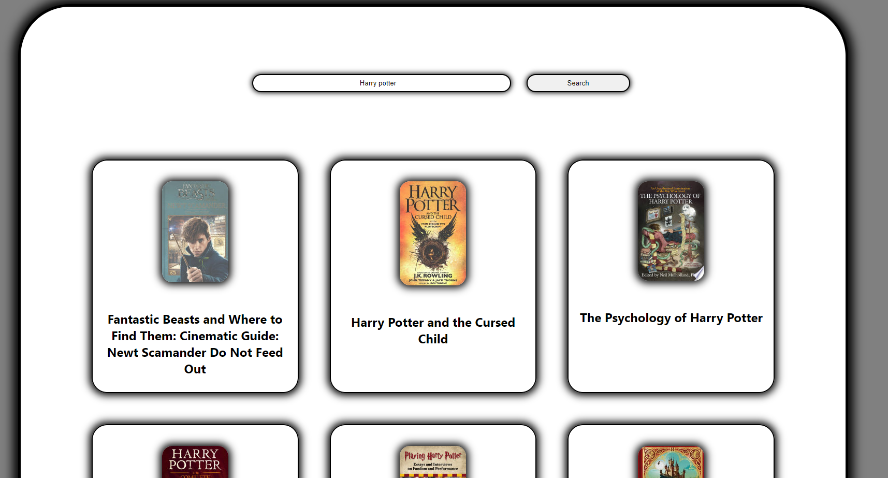
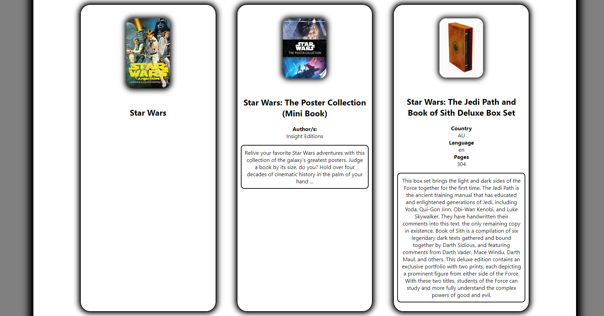

# Project_Google_Books_API

# Google Books API

## Description

This projects allow users to type any sort of book into the search bar and retrieve a list of books from the googleBooksAPI. Not only does this provide names and images but upon clicking the book cards, allows for brief information and then further information upon a second click

## Previews





## Setup & Uses

-   Once pulled from GIT, you need to install the neccessary packages from NPM using the following command

```
npm install
```

Use in the terminal of your GIT BASH or IDE terminal to start the react project

```
npm start
```

-   You only need to search it in the search bar to use

## Developer Thoughts

### Approach

-   I tend to focus more on readability and simplicity, over complexity and features, i started with getting the objects first with the goal in mind to display the books like cards which can be flipped over to reveal more information, things had to be changed but the end result was a good 90% to what i imagined

### Design Goals

-   The goal was to have fantasy images surrounding each book depending on its theme, such as a scifi may have space ships flying around the book, or atleast having a small animation while a fantasy one about dragons may have a dragon holding onto the book, although as the project went on i realised i cant draw, so that was a no and instead the design had to be more tame, not only that but the API didnt allow for themes to be shown

### Known Issues

-   As users may find out quickly, is that some books dont contain an image, author or description or other details, place holder images of books may be of use here

### Previous Issues

-   An issue faced was a rendering issue with the description level index, depending on how many times the user clicked on the book would show different levels of details, instead of a single click the user would have to click twice, and so instead of index++; being used, a ++index was used instead;

### Next time

-   For next time a differnet color scheme would be nice as the gray didnt really appeal to your general book audience as they tend to want more of an imaginative color scheme, pinks, blues and so on, maybe depending on the book type, along with the scifi / dragon theme idea too

    -   What? Why? How?

### Similar Projects

For similar projects check out my calculator project which contains code simplified down for ease of readability and use :)
